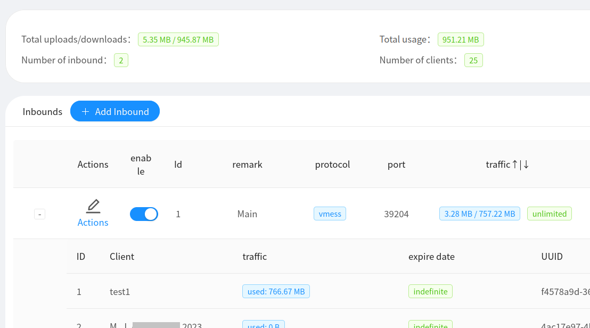
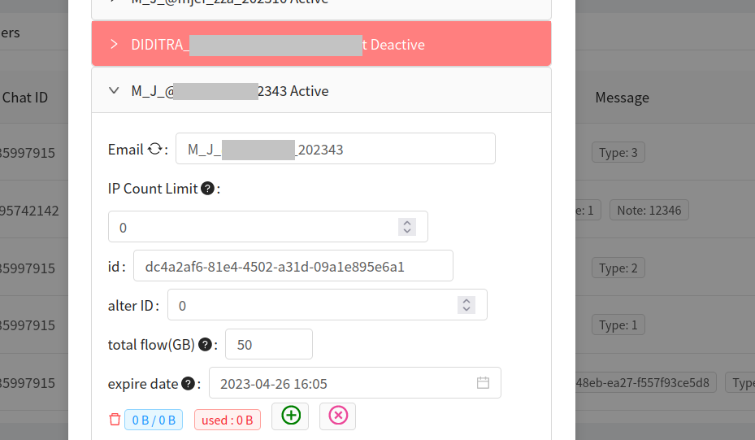
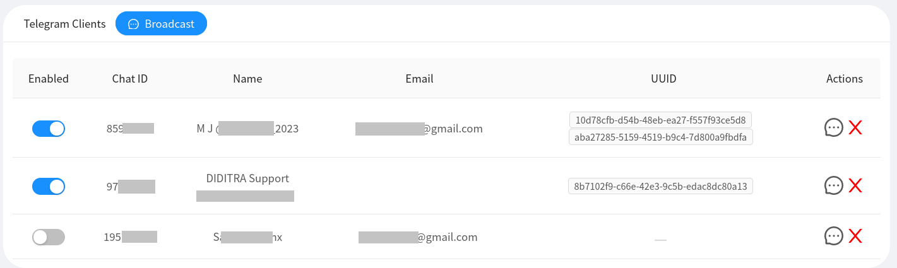
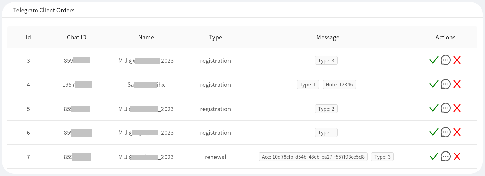
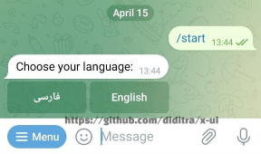
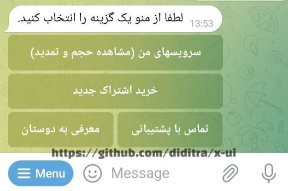
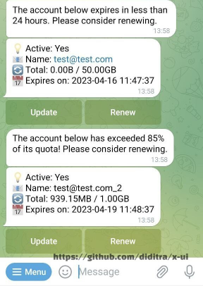
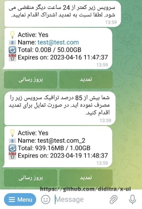

# DIDITRA x-ui
> **Disclaimer: This project is only for personal learning and communication, please do not use it for illegal purposes, please do not use it in a production environment**


DIDITRA x-ui is an xray panel supporting multiple protocols with a feature-rich multi-lingual Telegram bot (English and Persian as of now)

| Features      |
| ------------- |
| :heavy_check_mark: [Multi-user Inbounds](https://github.com/diditra/x-ui/#screenshots) |
| :heavy_check_mark: [Individual quota and expiry date for each user](https://github.com/diditra/x-ui/#screenshots) |
| :heavy_check_mark: REST API  |
| :heavy_check_mark: [Telegram BOT](https://github.com/diditra/x-ui/#telegram-bot) |
| :heavy_check_mark: [Screenshots](https://github.com/diditra/x-ui/#screenshots) |

**If you think this project is helpful to you, you may wish to give a** :star2: 
**or donate a small amount as a token of appreciation.**

-  `UQB_gzlhEi1BAr8S0_J_9zSafhqmd2HlsY7fd6wzbmvdCNT_`
-  `0xe45a0c30d3dd334dd84aace78f33fa11aceac80d`
-  `386KtbDKRQ9Zt8JG1saH1ea8YX73kmBqBN`
-  `0xe45a0c30d3dd334dd84aace78f33fa11aceac80d`
-  `LNxgWyMGJ1F3ydG8bH8JPcVL8o4gB1YTYP`

<br />

# Features

- System Status Monitoring
- Support multi-user multi-protocol, web page visualization operation
- Supported protocols: vmess, vless, trojan, shadowsocks, dokodemo-door, socks, http
- Supports feature-rich Telegram bot with built-in account management (VPN store)
- Traffic statistics, limit traffic, limit expiration time
- Customizable xray configuration templates
- Support https access panel (self-provided domain name + ssl certificate)
- Support one-click SSL certificate application and automatic renewal
- For more advanced configuration items, please refer to the panel

# Install & Upgrade

```
bash <(curl -Ls https://raw.githubusercontent.com/diditra/x-ui/master/install.sh)
```
## Install custom version
To install your desired version you can add the version to the end of install command. Example for ver `v1.1.0`:
```
bash <(curl -Ls https://raw.githubusercontent.com/diditra/x-ui/master/install.sh) v1.1.0
```

## Manual install & upgrade

1. First download the latest compressed package from https://github.com/diditra/x-ui/releases , generally choose Architecture `amd64`
2. Then upload the compressed package to the server's `/root/` directory and `root` rootlog in to the server with user

> If your server cpu architecture is not `amd64` replace another architecture

```
cd /root/
rm x-ui/ /usr/local/x-ui/ /usr/bin/x-ui -rf
tar zxvf x-ui-linux-amd64.tar.gz
chmod +x x-ui/x-ui x-ui/bin/xray-linux-* x-ui/x-ui.sh
cp x-ui/x-ui.sh /usr/bin/x-ui
cp -f x-ui/x-ui.service /etc/systemd/system/
mv x-ui/ /usr/local/
systemctl daemon-reload
systemctl enable x-ui
systemctl restart x-ui
```

## SSL certificate application

The script has a built-in SSL certificate application function. To use this script to apply for a certificate, you need the following:

- Cloudflare registered email
- Cloudflare Global API Key
- The domain name has been resolved to the current server through cloudflare

Run the "x-ui" command on the server and from the menu choose 16. Then enter the information as requested by the script.

Precautions:

- The script uses DNS API for certificate request
- By default, Let'sEncrypt is used as the CA party
- The certificate installation directory is the /root/cert directory
- The certificates applied for by this script are all generic domain name certificates

## Telegram Bot

DIDITRA x-ui has a feature-rich Telegram bot which is linked to the customer management features on the panel. The end-user bot supports multiple languages (Farsi/English at the moment) and most of the messages are easily configurable via the settings page of the panel.

### Admin-side bot

DIDITRA x-ui supports daily traffic notification, panel login reminder and other functions through the admin TG robot. To use the TG robot, you need to set the Telegram bot parameters on the panel, including:

- TG Robot Token
- TG Robot ChatId
- TG robot cycle runtime, in crontab syntax


Reference syntax:

- 30 * * * * * // Notify at the 30s of each point
- @hourly // hourly notification
- @daily // Daily notification (00:00 in the morning)
- @every 8h // notify every 8 hours
- TG notification content:
  - Node traffic usage
  - Panel login reminder
  - Node expiration reminder
  - Traffic warning reminder

More features are coming soon...

### Client-side bot

DIDITRA x-ui has a simple VPN shop via Telegram that can be enabled on the settings page under "Telegram CRM". You can configure quite a few of the messages that are sent to the user during the ordering and renewal. Here are some of the features of our TG bot with some screenshots.

- Clients can order and renew their accounts via Telegram
- Multiple accounts per each Telegram ID
- Payment receipt will be forwarded to the admin as soon as the user completes the order
- Reminder of expiration (less than 24 hours or less than 15% of the quota)
- Contact support and refer to friends

## Screenshots

### Panel



<br />



<br />



<br />



### Client-side Telegram bot



<br />



    

## Supported operating systems

- Ubuntu 20+ (the only OS actively tested)
- CentOS 7+
- Debian 8+

## Stargazers over time

[](https://starchart.cc/diditra/x-ui)
